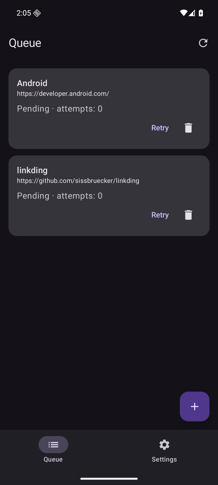
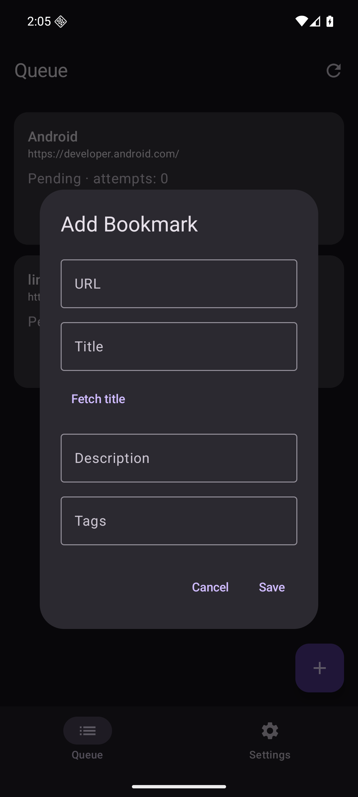
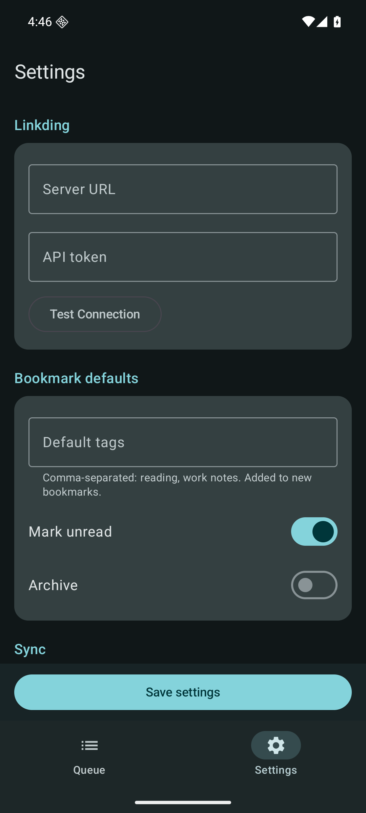

# ShareDing for Android


[](https://github.com/juev/shareding/actions/workflows/android.yml)
[](https://github.com/juev/shareding/releases)

ShareDing is an Android share target for [linkding](https://github.com/sissbruecker/linkding). It saves links from other apps to a local queue, then sends them to your linkding server. It requires Android 9 (API 28) or newer.

[Releases](https://github.com/juev/shareding/releases) · [Quick start](#quick-start) · [Screenshots](#screenshots) · [Contributing](#contributing) · [License](#license)

## Why it exists

Saving a link should not depend on whether your linkding server is reachable at that moment. It may be offline or accessible only when your phone joins your home network or VPN. ShareDing records the link on the phone first, so you can leave the Share menu immediately and let Android deliver it later. This project brings the sharing workflow of the iOS ShareDing app to Android, using Android's background work and network signals for delivery.

## How it works

1. Share an HTTP(S) link to ShareDing from a browser or another app, or enter it in the Add Bookmark form. You can save links before configuring the server.
2. ShareDing writes the bookmark to a Room database on the device before attempting a network request. The browser stays visible; a short `Saved to queue` Toast appears only after the local write succeeds. Invalid links and local save errors get a different message.
3. WorkManager runs sync when a network is available. ShareDing checks the configured linkding server itself, so a server reachable through LAN or VPN does not need public internet access.
4. After linkding accepts the bookmark, ShareDing removes it from the queue. Connection and server errors leave it queued for another attempt. Retries use exponential backoff starting at 30 seconds; Android may run them later than the scheduled time.

The queue survives app restarts and device reboots. Delivery is at least once: if linkding accepts a request but the response is lost, ShareDing may send the same URL again. Linkding updates an existing bookmark with that URL.

## Screenshots

These screens were captured on an Android 16 emulator with example links in the queue. No linkding server or API token was configured.

| Queue | Add Bookmark | Settings |
| --- | --- | --- |
| <a href="docs/images/queue.png"></a> | <a href="docs/images/add-bookmark.png"></a> | <a href="docs/images/settings.png"></a> |

## Quick start

1. Install the APK using [Obtainium](https://github.com/ImranR98/Obtainium) or download it from [Releases](https://github.com/juev/shareding/releases). See [Install and update](#install-and-update) for details.
2. In Settings, enter your linkding server URL and API token, then tap **Save settings** at the bottom. Use **Test Connection** to check the server. HTTPS is recommended; HTTP is also supported for servers on a trusted LAN or VPN.
3. Open a browser's Share menu and select **ShareDing**. It returns to the browser after a short confirmation without opening the main app screen. You can also tap `+` in Queue to add a link manually. The full-screen form accepts a URL, title, description, and tags; **Fetch title** can fill in the page title.
4. Check Queue for waiting, sending, or failed bookmarks. Failed entries have a **Retry** action; **Sync Now** in Settings requests another attempt. Removing an entry requires confirmation.

Settings also lets you set default tags and choose whether new bookmarks are marked unread or archived. Enter multiple tags with commas, for example `reading, work notes`, then tap **Save settings**. With a configured connection, existing linkding tags appear as suggestions while you type in Settings or Add Bookmark. You can still enter new tags and save while the server is offline.

Settings shows the queue count, last successful sync, latest error, and an inline Test Connection result. The API token is encrypted using a key held in Android Keystore. If you use HTTP, Settings warns that the token and bookmark data are sent without TLS.

ShareDing is written in Kotlin. Jetpack Compose provides the interface, Room stores the queue, and WorkManager handles background sync.

## Install and update

For automatic update checks, use [Obtainium](https://github.com/ImranR98/Obtainium). Add `https://github.com/juev/shareding` as a source and install its latest stable APK. Enable **Include prereleases** only if you want test builds.

For manual installation, open [Releases](https://github.com/juev/shareding/releases) on your phone, download the latest APK, and confirm the installation. If Android asks for permission to install apps from this source, grant it to your browser or file manager. To update, download the newer APK and install it over the current version.

You can also install the downloaded APK over USB with `adb install -r /path/to/downloaded.apk`. All methods require Android 9 or newer. Release APKs use the same signing key, which Android requires for updates. Debug APKs use a different key. If you already installed a debug build, uninstall it before installing the release build. Uninstalling deletes its settings and local queue.

## Build

Install JDK 17 or newer, Android SDK Platform 36, and Build Tools 36.0.0. Set the SDK path with `ANDROID_HOME` or `local.properties` (`sdk.dir=...`).

```sh
./gradlew assembleDebug
./gradlew testDebugUnitTest
./gradlew lintDebug
./gradlew connectedDebugAndroidTest
```

The last command requires a running emulator or connected device. The debug APK is at `app/build/outputs/apk/debug/app-debug.apk`; install it with `adb install -r app/build/outputs/apk/debug/app-debug.apk`.

CI builds the app and runs unit tests and lint for pushes to `main` and pull requests. For a release, increment `versionCode` and update `versionName` in `app/build.gradle.kts`, commit and push the change to `main`, then push a `v`-prefixed tag on that commit matching `versionName`. The [release workflow](.github/workflows/release.yml) builds and signs the APK, checks the tag against the package version, and publishes a GitHub Release with the APK and a SHA-256 checksum. You can run the workflow manually to check signing without publishing a release.

The workflow reads the signing key and password from GitHub Actions repository secrets. For a local signed build on macOS, run `./scripts/build-release-macos.sh`; it reads the key from `$HOME/.local/share/shareding/release.jks` and its password from macOS Keychain (service `org.evsyukov.shareding.release`, account `shareding`). Set `SHAREDING_RELEASE_KEYSTORE` and `SHAREDING_RELEASE_PASSWORD` to use other locations. The signed APK is written to `app/build/outputs/apk/release/app-release.apk`. Back up the key and password securely: without them, future APKs cannot update existing installations. See [Android App Signing](https://developer.android.com/studio/publish/app-signing) for the signing key requirement.

The behavior contract is in the [specification](docs/specs/share-to-linkding.md).

## Contributing

See [CONTRIBUTING.md](CONTRIBUTING.md) for bug reports, feature requests, and pull requests. Report suspected vulnerabilities privately using the [security policy](SECURITY.md).

## License

ShareDing is available under the [MIT License](LICENSE).
